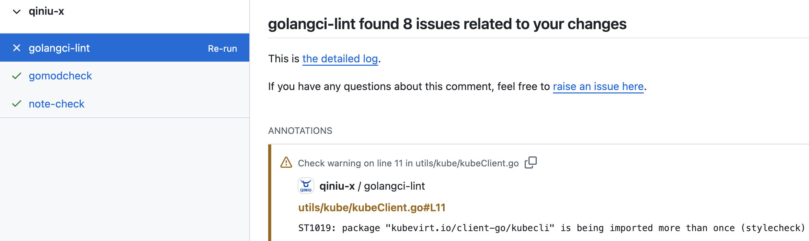
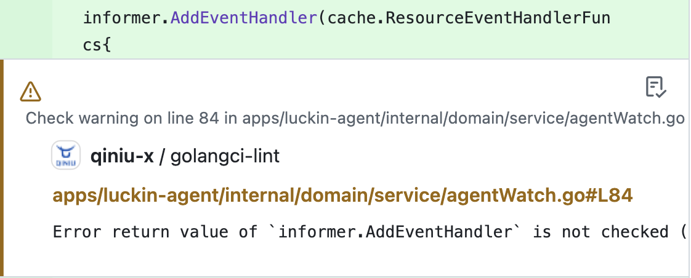
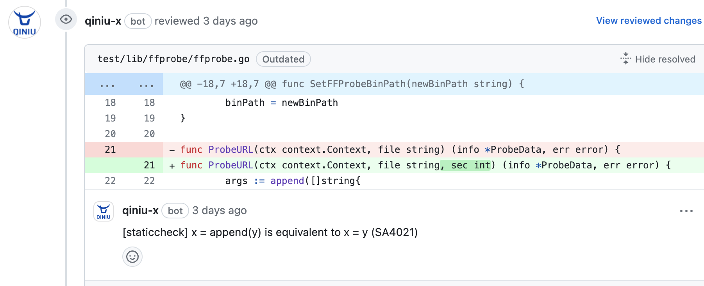
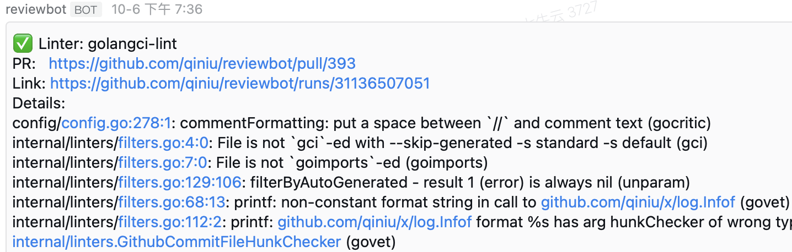
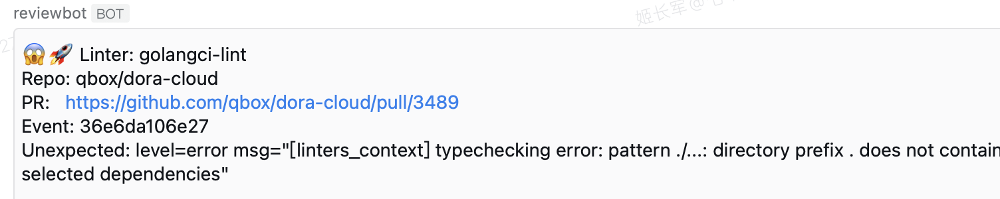

# Reviewbot - Empower Your Code Quality with Self-Hosted Automated Analysis and Review

[](https://github.com/qiniu/reviewbot/actions/workflows/go.yml)
[](https://goreportcard.com/report/github.com/qiniu/reviewbot)
[](https://github.com/qiniu/reviewbot/releases)

[中文](./README_zh.md)

Reviewbot assists you in rapidly establishing a self-hosted code analysis and review service, supporting multiple languages and coding standards. It is particularly suitable for organizations with numerous private repositories.

All issues are reported during the Pull Request stage, either as `Review Comments` or `Github Annotations`, precisely pinpointing the relevant code lines.

- Github Check Run (Annotations)

  <div style="display: flex; justify-content: flex-start; gap: 10px;">
    
    
  </div>

- Github Pull Request Review Comments
  <div style="display: flex; justify-content: flex-start;">
    
  </div>

This approach helps PR authors avoid searching for issues in lengthy console logs, significantly facilitating problem resolution.

[see introduction blog](https://medium.com/@dacarl.ji/reviewbot-boost-your-code-quality-with-self-hosted-automated-analysis-and-review-83d8a459eb70)

## Table of Contents

- [Why Reviewbot](#why-reviewbot)
- [Installation](#installation)
- [Supported Linters](#supported-linters)
  - [Go](#go)
  - [C/C++](#cc)
  - [Lua](#lua)
  - [Java](#java)
  - [Shell](#shell)
  - [Git Workflow Standards](#git-workflow-standards)
  - [Documentation Standards](#documentation-standards)
- [Configuration](#configuration)
  - [Adjusting Execution Commands](#adjusting-execution-commands)
  - [Disabling a Linter](#disabling-a-linter)
  - [Cloning multiple repositories](#cloning-multiple-repositories)
  - [Executing Linters via Docker](#executing-linters-via-docker)
  - [Executing Linters via Kubernetes](#executing-linters-via-kubernetes)
- [Reviewbot Operational Flow](#reviewbot-operational-flow)
- [How to add a new Linter](#how-to-add-a-new-linter)
- [Monitoring Detection Results](#monitoring-detection-results)
- [Contributing](#contributing)
- [License](#license)

## Why Reviewbot

Reviewbot is a self-hosted code analysis and review service supporting multiple languages and coding standards. It is particularly beneficial for organizations with numerous private repositories:

- **Security** - Recommended self-hosting for data security and control
- **Improvement-Oriented** - Detected issues are primarily reported in the form of Review Comments or Github Annotations, facilitating efficient problem resolution and code improvement
- **Flexibility** - Supports multiple languages and coding standards, with easy integration of new code inspection tools
- **Observability** - Supports alert notifications for timely awareness of detected issues
- **Configurable** - Supports configuration of linter execution commands, parameters, and environments, providing flexibility for complex scenarios

Reviewbot is developed using Golang, featuring simple logic and clear code, making it easy to understand and maintain.

## Installation

Please refer to the [getting started guide](https://reviewbot-x.netlify.app/getting-started/installation).

The following are internal usage practices at Qiniu, which may provide you with more inspiration:

- Deployed in a [Kubernetes cluster](https://github.com/qiniu/reviewbot/tree/master/deploy/reviewbot.yaml)
- Using this [Dockerfile](https://github.com/qiniu/reviewbot/tree/master/Dockerfile) to build the Reviewbot image

## Supported Linters

### Go

- [golangci-lint](/internal/linters/go/golangci_lint/)
- [gofmt](/internal/linters/go/gofmt/)
- [gomodcheck](/internal/linters/go/gomodcheck/)

### C/C++

- [cppcheck](/internal/linters/c/cppcheck/)

### Lua

- [luacheck](/internal/linters/lua/luacheck/)

### Java

- [pmdcheck](/internal/linters/java/pmdcheck/)
- [stylecheck](/internal/linters/java/stylecheck/)

### Shell

- [shellcheck](/internal/linters/shell/shellcheck/)

### Git Workflow Standards

- [commit msg check](/internal/linters/git-flow/commit/)

### Documentation Standards

- [note check](/internal/linters/doc/note-check/)

## Configuration

Reviewbot adheres to a **zero-configuration principle** whenever possible, with fixed code logic for general repository inspections. However, some special requirements can be met through configuration.

Note: All configurable items are defined in the `config/config.go` file. Please refer to this file for detailed configuration options.

The following are some common configuration scenarios:

### Adjusting Execution Commands

Linters are generally executed using default commands, but we can adjust these commands. For example:

```yaml
qbox/kodo:
  linters:
    staticcheck:
      workDir: "src/qiniu.com/kodo"
```

This configuration means that for the `staticcheck` inspection of the `qbox/kodo` repository code, execution should occur in the `src/qiniu.com/kodo` directory.

We can even configure more complex commands, such as:

```yaml
qbox/kodo:
  linters:
    golangci-lint:
      command:
        - "/bin/sh"
        - "-c"
        - "--"
      args:
        - |
          source env.sh
          cp .golangci.yml src/qiniu.com/kodo/.golangci.yml
          cd src/qiniu.com/kodo
          export GO111MODULE=auto
          go mod tidy
          golangci-lint run --timeout=10m0s --allow-parallel-runners=true --print-issued-lines=false --out-format=line-number >> $ARTIFACT/lint.log 2>&1
```

This configuration indicates that for the `golangci-lint` inspection of the `qbox/kodo` repository code, execution occurs through custom commands and arguments.

The usage of command and args here is similar to that of Kubernetes Pod command and args. You can refer to [Kubernetes Pod](https://kubernetes.io/docs/concepts/workloads/pods/) for more information.

The **$ARTIFACT** environment variable is noteworthy. This is a built-in variable in Reviewbot used to specify the output directory, facilitating the exclusion of irrelevant interference. Since Reviewbot ultimately only cares about the linters' output, and in this complex scenario, the shell script will output a lot of irrelevant information, we can use this environment variable to specify the output directory. This allows Reviewbot to parse only the files in this directory, resulting in more precise detection results.

### Disabling a Linter

We can also disable a specific linter check for a particular repository through configuration. For example:

```yaml
qbox/net-gslb:
  linters:
    golangci-lint:
      enable: false
```

This configuration means that the `golangci-lint` check is disabled for the `qbox/net-gslb` repository.

### Cloning multiple repositories

By default, Reviewbot clones the repository where the event occurs. However, in some scenarios, we might want to clone multiple repositories, and customizing the cloning path.

For example:

```yaml
qbox/net-gslb:
  refs:
    - org: "qbox"
      repo: "net-gslb"
      pathAlias: "src/qiniu.com/net-gslb"
    - org: "qbox"
      repo: "kodo"
```

### Executing Linters via Docker

By default, Reviewbot uses locally installed linters for checks. However, in some scenarios, we might want to use Docker images to execute linters, such as:

- When the relevant linter is not installed locally
- When the target repository requires different versions of linters or dependencies
- When the target repository depends on many third-party libraries, which would be cumbersome to install locally

In these scenarios, we can configure Docker images to execute the linters. For example:

```yaml
qbox/net-gslb:
  linters:
    golangci-lint:
      dockerAsRunner:
        image: "golangci/golangci-lint:v1.54.2"
```

This configuration means that for the `golangci-lint` check of the `qbox/net-gslb` repository code, the `golangci/golangci-lint:v1.54.2` Docker image is used for execution.

### Executing Linters in Kubernetes Cluster

Reviewbot also supports executing linters in a Kubernetes cluster. This is particularly useful in scenarios where multiple tasks are running concurrently, and local resources are insufficient.

Example configuration:

```yaml
qiniu/reviewbot:
  linters:
    golangci-lint:
      enable: true
      kubernetesAsRunner:
        image: "aslan-spock-register.qiniu.io/reviewbot/base:golangci-lint.1.61.0"
        namespace: "reviewbot"
```

## Reviewbot Operational Flow

Reviewbot primarily operates as a GitHub Webhook service, accepting GitHub Events, executing various checks, and providing precise feedback on the corresponding code if issues are detected.

```
Github Event -> Reviewbot -> Execute Linter -> Provide Feedback
```

### Basic Flow:

- Event received, determine if it's a Pull Request
- Retrieve code:
  - Get the code affected by the PR
  - Clone the main repository
    - The main repository serves as a cache
  - Checkout the PR and place it in a temporary directory
  - Pull submodules
    - If the repository uses submodule management, code is automatically pulled
- Enter Linter execution logic
  - Filter linters
    - By default, all supported linters apply to all repositories unless individually configured
      - Individual configurations need to be explicitly specified in the configuration file
      - Explicitly specified configurations override default configurations
  - Execute linter
  - General logic
    - Execute the corresponding command and obtain the output results
    - Filter the output results, only obtaining the parts relevant to this PR
      - Some linters focus on code
      - Some linters focus on other aspects
  - Provide feedback
    - Some linters provide Code Comments, precise to the code line
    - Some linters provide issue comments

## How to Add a New Linter?

- Please select an Issue you want to address from the [issues](https://github.com/qiniu/reviewbot/issues) list.
  - Of course, if there isn't one, you can first create an Issue describing the Linter you want to add
- Coding
  - Based on the language or domain the linter focuses on, [choose the appropriate code location](https://github.com/qiniu/reviewbot/tree/master/internal/linters)
  - The implementation logic for most linters is divided into three main parts:
    - Execute the linter, generally by calling the relevant executable program
    - Process the linter's output, focusing only on the output related to the current PR
    - Provide feedback on the output related to the current PR, precise to the code line
- Deployment: If your linter is an external executable program, you'll need to add instructions on how to install this linter in the [Dockerfile](https://github.com/qiniu/reviewbot/blob/master/Dockerfile)
- Documentation: To facilitate subsequent use and maintenance, we should [add appropriate documentation here](https://github.com/qiniu/reviewbot/tree/master/docs/website/docs/components)

## Monitoring Detection Results

Reviewbot supports notification of detection results through WeWork (企业微信) alerts. For specific implementation details, refer to [here](https://github.com/qiniu/reviewbot/blob/8bfb122a2e4292f1cc74aedab8f51d1a0c149d55/internal/metric/metrics.go#L17).

To enable this feature, simply set the environment variable `WEWORK_WEBHOOK` when starting Reviewbot. This environment variable should point to the WeWork chat group's bot URL. When valid issues are detected, notifications will be sent automatically. For example:

<div style="display: flex; justify-content: flex-start;">
  
</div>

If unexpected output is encountered, notifications will also be sent, like this:

<div style="display: flex; justify-content: flex-start;">
  
</div>

For unexpected outputs, **it usually means that the default execution configuration of the relevant linter does not support the current repository**. In such cases, you need to explicitly specify the configuration through a configuration file based on the actual situation.

## Contributing

Your contributions to Reviewbot are essential for its long-term maintenance and improvement. Thanks for supporting Reviewbot!

If you find a bug while working with the Reviewbot, please open an issue on GitHub and let us know what went wrong. We will try to fix it as quickly as we can.

## License

Reviewbot is released under the Apache 2.0 license. See the [LICENSE](/LICENSE) file for details.
