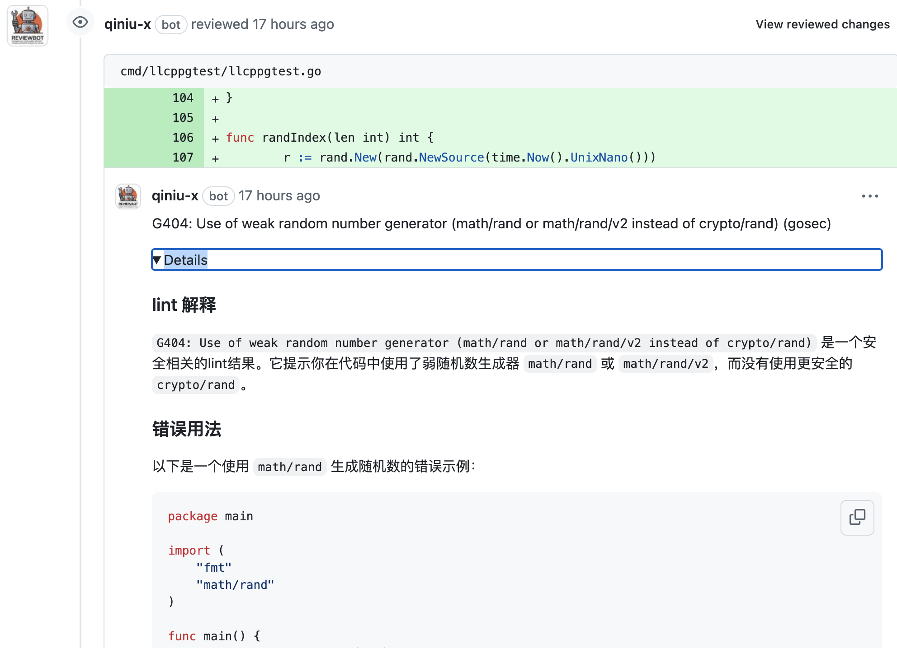

# Reviewbot - Empower Your Code Quality with Self-Hosted Automated Analysis and Review

[](https://github.com/qiniu/reviewbot/actions/workflows/go.yml)
[](https://goreportcard.com/report/github.com/qiniu/reviewbot)
[](https://github.com/qiniu/reviewbot/releases)

[中文](./README_zh.md)

Reviewbot assists you in rapidly establishing a self-hosted code analysis and review service, supporting multiple languages and coding standards. Its main features include:

- **Universal Compatibility** - Provides a universal way to integrate and execute Linters without coding
- **Multi-Platform Support** - Currently supports both GitHub and GitLab
- **AI-Powered** - Detected issues are analyzed by AI to provide detailed explanations and improvement suggestions
- **Precise Feedback** - All issues are reported during the Pull/Merge Request stage as comments, precisely pinpointing the relevant code lines
- **Self-Hosted Deployment** - Recommended self-hosting for better data security and control

See practical examples:

<div style="display: flex; justify-content: flex-start; gap: 10px;">
  
  
</div>

## Table of Contents

- [Why Reviewbot](#why-reviewbot)
- [Installation](#installation)
- [Linter Integration Guide](#linter-integration-guide)
  - [Universal Integration (No Coding Required)](#universal-linter-integration-no-coding-required)
  - [Custom Integration](#custom-integration)
- [Supported Linters](#supported-linters)
  - [Go](#go)
  - [Python](#python)
  - [C/C++](#cc)
  - [Lua](#lua)
  - [Java](#java)
  - [Shell](#shell)
  - [Git Workflow Standards](#git-workflow-standards)
  - [Documentation Standards](#documentation-standards)
- [Configuration](#configuration)
  - [Adjusting Execution Commands](#adjusting-execution-commands)
  - [Disabling a Linter](#disabling-a-linter)
  - [Cloning multiple repositories](#cloning-multiple-repositories)
  - [Executing Linters via Docker](#executing-linters-via-docker)
  - [Executing Linters via Kubernetes](#executing-linters-via-kubernetes)
- [AI Enhancement](#ai-enhancement)
- [Reviewbot Operational Flow](#reviewbot-operational-flow)
- [Monitoring Detection Results](#monitoring-detection-results)
- [Contributing](#contributing)
- [License](#license)

## Why Reviewbot

Reviewbot is a self-hosted code analysis and review service with the following features:

- **Universal Compatibility** - Provides a universal way to integrate new code checking tools without modifying source code
- **Multi-Platform Support** - Currently supports both GitHub and GitLab platforms
- **AI-Powered** - Issues detected are analyzed by AI to provide detailed context and fix suggestions
- **Security** - Recommended self-hosting for data security and control
- **Improvement-Oriented** - Detected issues are primarily reported as comments precise to code lines, facilitating efficient problem resolution
- **Flexibility** - Supports multiple languages and coding standards with flexible configuration
- **Observability** - Supports alert notifications for timely awareness of detected issues

## Installation

Please refer to the [getting started guide](https://reviewbot-x.netlify.app/getting-started/installation).

The following are internal usage practices at Qiniu, which may provide you with more inspiration:

- Deployed in a [Kubernetes cluster](https://github.com/qiniu/reviewbot/tree/master/deploy/reviewbot.yaml)
- Using this [Dockerfile](https://github.com/qiniu/reviewbot/tree/master/Dockerfile) to build the Reviewbot image

## Linter Integration Guide

### Universal Linter Integration (No Coding Required)

Reviewbot provides a universal way to integrate new code checking tools without modifying the source code.

For example:

```yaml
customLinters:
  pylint:
    languages: [".py"] # Specify supported languages
    command: ["/bin/sh", "-c", "--"] # Specify execution command
    args: # Specify execution arguments
      - |
        pylint --disable=line-too-long --output-format=text --msg-template='{path}:{line}:{column}: {msg} ({symbol})' --reports=n --score=n --recursive=y ./
```

Complete configuration reference:

```yaml
customLinters:
  <linter-name>:
    languages: <language-list> # optional, specify supported languages
    enable: <true|false> # optional, enable/disable this linter
    workDir: <work-dir> # optional, specify working directory
    command: <command-list> # optional, specify execution command
    args: <args-list> # optional, specify execution arguments
    env: <env-list> # optional, specify environment variables
    dockerAsRunner: # optional, use Docker image to execute linter
      image: <docker-image>
    kubernetesAsRunner: # optional, use Kubernetes to execute linter
      namespace: <kubernetes-namespace>
      image: <kubernetes-image>
    reportType: <report-type> # optional, specify report type
    configPath: <config-path> # optional, specify linter config file path
```

### Custom Integration

For more complex scenarios, you can also consider code integration:

- For self-implemented linters or standards, refer to [commit msg check](/internal/linters/git-flow/commit/), [go mod check](/internal/linters/go/gomodcheck/), etc.
- For customizing linter execution logic in complex scenarios, refer to [golangci-lint](/internal/linters/go/golangci_lint/), [gofmt](/internal/linters/go/gofmt/), etc.

## Supported Linters

The following are the linters currently supported by Reviewbot:

### Go

- [golangci-lint](/internal/linters/go/golangci_lint/)
- [gofmt](/internal/linters/go/gofmt/)
- [gomodcheck](/internal/linters/go/gomodcheck/)

### Python

- pylint

### C/C++

- [cppcheck](/internal/linters/c/cppcheck/)

### Lua

- [luacheck](/internal/linters/lua/luacheck/)

### Java

- [pmdcheck](/internal/linters/java/pmdcheck/)
- [stylecheck](/internal/linters/java/stylecheck/)

### Shell

- [shellcheck](/internal/linters/shell/shellcheck/)

### Git Workflow Standards

- [commit msg check](/internal/linters/git-flow/commit/)

### Documentation Standards

- [note check](/internal/linters/doc/note-check/)

## Configuration

Reviewbot adheres to a **zero-configuration principle** whenever possible, but also provides flexible configuration capabilities for special requirements. All configurable items are defined in the `config/config.go` file.

The following are some common configuration scenarios:

### Adjusting Execution Commands

Linters are generally executed using default commands, but we can adjust these commands. For example:

```yaml
qbox/kodo:
  linters:
    staticcheck:
      workDir: "src/qiniu.com/kodo"
```

This configuration means that for the `staticcheck` inspection of the `qbox/kodo` repository code, execution should occur in the `src/qiniu.com/kodo` directory.

We can even configure more complex commands, such as:

```yaml
qbox/kodo:
  linters:
    golangci-lint:
      command:
        - "/bin/sh"
        - "-c"
        - "--"
      args:
        - |
          source env.sh
          cp .golangci.yml src/qiniu.com/kodo/.golangci.yml
          cd src/qiniu.com/kodo
          export GO111MODULE=auto
          go mod tidy
          golangci-lint run --timeout=10m0s --allow-parallel-runners=true --print-issued-lines=false --out-format=line-number >> $ARTIFACT/lint.log 2>&1
```

This configuration indicates that for the `golangci-lint` inspection of the `qbox/kodo` repository code, execution occurs through custom commands and arguments.

The usage of command and args here is similar to that of Kubernetes Pod command and args. You can refer to [Kubernetes Pod](https://kubernetes.io/docs/concepts/workloads/pods/) for more information.

The **$ARTIFACT** environment variable is noteworthy. This is a built-in variable in Reviewbot used to specify the output directory, facilitating the exclusion of irrelevant interference. Since Reviewbot ultimately only cares about the linters' output, and in this complex scenario, the shell script will output a lot of irrelevant information, we can use this environment variable to specify the output directory. This allows Reviewbot to parse only the files in this directory, resulting in more precise detection results.

### Disabling a Linter

We can also disable a specific linter check for a particular repository through configuration. For example:

```yaml
qbox/net-gslb:
  linters:
    golangci-lint:
      enable: false
```

This configuration means that the `golangci-lint` check is disabled for the `qbox/net-gslb` repository.

We can also globally disable a linter, like this:

```yaml
customLinters:
  golangci-lint:
    enable: false
```

### Cloning multiple repositories

By default, Reviewbot clones the repository where the event occurs. However, in some scenarios, we might want to clone multiple repositories, and customizing the cloning path.

For example:

```yaml
qbox/net-gslb:
  refs:
    - org: "qbox"
      repo: "net-gslb"
      pathAlias: "src/qiniu.com/net-gslb"
    - org: "qbox"
      repo: "kodo"
```

### Executing Linters via Docker

By default, Reviewbot uses locally installed linters for checks. However, in some scenarios, we might want to use Docker images to execute linters, such as:

- When the relevant linter is not installed locally
- When the target repository requires different versions of linters or dependencies
- When the target repository depends on many third-party libraries, which would be cumbersome to install locally

In these scenarios, we can configure Docker images to execute the linters. For example:

```yaml
qbox/net-gslb:
  linters:
    golangci-lint:
      dockerAsRunner:
        image: "golangci/golangci-lint:v1.54.2"
```

This configuration means that for the `golangci-lint` check of the `qbox/net-gslb` repository code, the `golangci/golangci-lint:v1.54.2` Docker image is used for execution.

### Executing Linters in Kubernetes Cluster

Reviewbot also supports executing linters in a Kubernetes cluster. This is particularly useful in scenarios where multiple tasks are running concurrently, and local resources are insufficient.

Example configuration:

```yaml
qiniu/reviewbot:
  linters:
    golangci-lint:
      enable: true
      kubernetesAsRunner:
        image: "aslan-spock-register.qiniu.io/reviewbot/base:golangci-lint.1.61.0"
        namespace: "reviewbot"
```

## AI Enhancement

Reviewbot integrates AI analysis capabilities to provide more detailed explanations and improvement suggestions for detected issues:



## Reviewbot Operational Flow

Reviewbot primarily operates as a Webhook service, accepting GitHub or GitLab Events, executing various checks, and providing precise feedback on the corresponding code if issues are detected.

```
Webhook Event -> Reviewbot -> Execute Linter -> Provide Feedback
```

## Monitoring Detection Results

Reviewbot supports notification of detection results through WeWork (企业微信) alerts. For specific implementation details, refer to [here](https://github.com/qiniu/reviewbot/blob/8bfb122a2e4292f1cc74aedab8f51d1a0c149d55/internal/metric/metrics.go#L17).

To enable this feature, simply set the environment variable `WEWORK_WEBHOOK` when starting Reviewbot. This environment variable should point to the WeWork chat group's bot URL. When valid issues are detected, notifications will be sent automatically. For example:

<div style="display: flex; justify-content: flex-start;">
  
</div>

If unexpected output is encountered, notifications will also be sent, like this:

<div style="display: flex; justify-content: flex-start;">
  
</div>

For unexpected outputs, **it usually means that the default execution configuration of the relevant linter does not support the current repository**. In such cases, you need to explicitly specify the configuration through a configuration file based on the actual situation.

## Give it a Star! ⭐

If you like this project or are using it to learn or start your own solution, please give it a star to receive updates about new versions. Your support matters!

## Contributing

Your contributions to Reviewbot are essential for its long-term maintenance and improvement. Thanks for supporting Reviewbot!

If you find a bug while working with the Reviewbot, please open an issue on GitHub and let us know what went wrong. We will try to fix it as quickly as we can.

## License

Reviewbot is released under the Apache 2.0 license. See the [LICENSE](/LICENSE) file for details.
