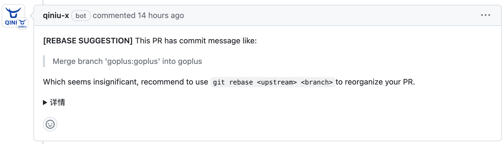

# reviewbot 

## Why Reviewbot?

Thank for the community, there is a wide range of lint tools available for almost every programming language. However, many of these tools rely on a command-line interface (CLI) and require configuring jobs in CI systems like Github Action, Travis, and others. While this is typically manageable, it can become tedious when dealing with a large number of repositories that need to be configured.

Additionally, when working with repositories that already have numerous existing lint issues, adding lint tools can be challenging. Existing lint issues may cause CI jobs to fail. While it's easy to ignore or skip these errors, it's important to remember to address them in the future.

Furthermore, traditional CI errors are often only displayed in the console, necessitating manual identification. However, automating the process by providing specific line-level comments for detected issues offers a more elegant and user-friendly approach for developers.

In such scenarios, reviewbot is an ideal service to consider. It allows you to set up your own service that can receive events from GitHub and automatically perform various linting checks, providing precise feedback on specific lines of code that require attention. Enjoy the benefits of safety, customization, and powerful linting capabilities.

Please note that reviewbot is still in its early stages, and we have plans to integrate more lint tools and support additional code hosting platforms such as GitLab. We are also exploring the possibility of incorporating AI for code review purposes.

Lastly, we welcome any contributions to the project! Your bug reports, feature suggestions, and active participation in the development process are greatly appreciated. Together, we can make reviewbot even better.

## Features

<b>Linters for the Go programming language</b>

 

- [staticcheck](internal/linters/go/staticcheck)
    > As above

 

<b>Linters for git flow interactions</b>

 

- [rebase suggestion](internal/linters/git-flow/rebase-suggestion)
  > 

 

