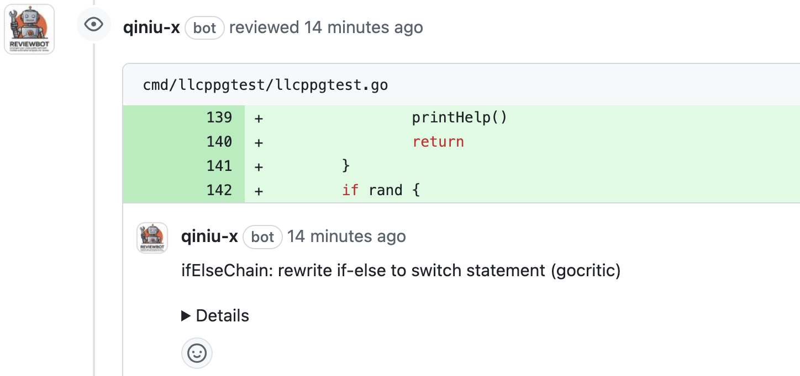
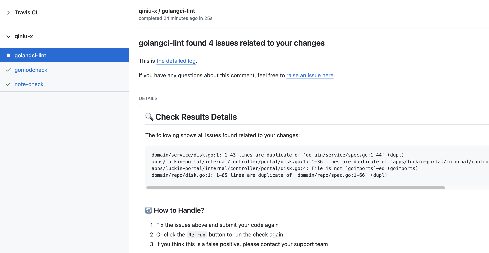
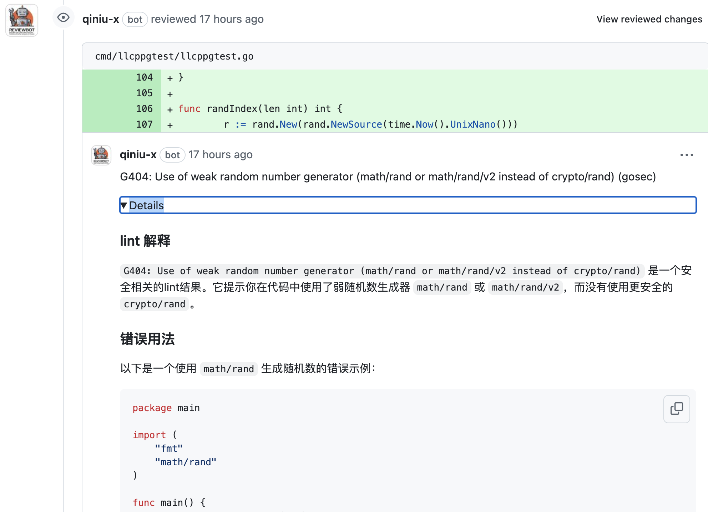

# Reviewbot - Empower Your Code Quality with Self-Hosted Automated Analysis and Review

[](https://github.com/qiniu/reviewbot/actions/workflows/go.yml)
[](https://goreportcard.com/report/github.com/qiniu/reviewbot)
[](https://github.com/qiniu/reviewbot/releases)

Reviewbot 帮助你快速搭建一个自托管的代码分析和代码审查服务，支持多种语言和多种代码规范，尤其适合有大量私有仓库的组织。它的主要特点是:

- **通用性强** - 提供了通用的 Linter 接入和执行方式，无需编写代码即可接入各种检查工具
- **多平台支持** - 当前已支持 GitHub 和 GitLab
- **AI 赋能** - 检测出的问题会通过 AI 分析并提供详细的解释说明, 方便理解和改进
- **精准反馈** - 所有问题都会尽可能在 Pull/Merge Request 阶段，以评论形式精确反馈到代码行，省却了在 console log 中查找问题的时间
- **自托管部署** - 推荐自托管方式部署，数据更安全可控

执行反馈示例:

<div style="display: flex; justify-content: flex-start; gap: 10px;">
  
  
</div>

## 目录

- [为什么选择 Reviewbot](#why-reviewbot)
- [安装部署](#安装)
- [Linter 接入指南](#如何接入-linter)
  - [通用 Linter 接入(无需写代码)](#通用-linter-接入无需写代码)
  - [定制化接入](#定制化接入)
- [已接入的 Linters 示例](#已接入的-linters)
  - [Go](#go-语言)
  - [Python](#python)
  - [C/C++](#cc)
  - [Lua](#lua)
  - [Java](#java)
  - [Shell](#shell)
  - [Git 流程规范](#git-流程规范)
  - [文档规范](#文档规范)
- [高级配置](#高级配置)
  - [调整执行命令](#调整执行命令)
  - [关闭 Linter](#关闭-linter)
  - [克隆多个仓库](#克隆多个仓库)
  - [通过 Docker 执行 linter](#通过-docker-执行-linter)
  - [在 Kubernetes 集群中执行 linter](#在-kubernetes-集群中执行-linter)
- [AI 赋能](#ai-赋能)
- [运行流程](#reviewbot-运行流程)
- [观测检测结果](#观测检测结果)
- [Talk](#talks)

## Why Reviewbot

Reviewbot 是一个自托管的代码分析和代码审查服务，具有以下特点:

- **通用性强** - 提供了通用的 Linter 接入配置方式，只需要简单配置就能集成新的代码检查工具，无需修改源码
- **多平台支持** - 目前已支持 GitHub 和 GitLab 两大主流代码托管平台
- **AI 赋能** - 检测出的问题会通过 AI 进行分析，提供更详细的上下文说明和修复建议
- **安全性** - 推荐自托管，数据安全可控
- **面向改进** - 检测出的问题，都会优先以评论形式精确反馈到代码行，方便问题改进
- **灵活性** - 支持多种语言和多种代码规范，配置灵活
- **可观测** - 支持 alert 通知，方便及时感知检测出的问题

## 安装

相关信息请参考 [getting started guide](https://reviewbot-x.netlify.app/getting-started/installation).

以下是七牛内部使用姿势，也许可以给你更多启发:

- 部署在 [Kubernetes 集群中](https://github.com/qiniu/reviewbot/tree/master/deploy/reviewbot.yaml)
- 使用的 [Dockerfile](https://github.com/qiniu/reviewbot/tree/master/Dockerfile) 构建 Reviewbot 镜像

## 如何接入 Linter

### 通用 Linter 接入(无需写代码)

Reviewbot 提供了一种通用的 Linter 接入方式，让你可以在不修改源码的情况下集成新的代码检查工具。

例如:

```yaml
customLinters:
  pylint:
    languages: [".py"] # 指定该 linter 支持的语言
    command: ["/bin/sh", "-c", "--"] # 指定执行的命令
    args: # 指定执行的参数
      - |
        pylint --disable=line-too-long --output-format=text --msg-template='{path}:{line}:{column}: {msg} ({symbol})' --reports=n --score=n --recursive=y ./
```

这样配置后, 当 PR/MR 里有改动 Python 代码时, 就会使用 pylint 来执行检查, 并将结果反馈到对应的代码行。

值得注意的是，上述配置会使用默认执行环境中的 pylint 来执行检查。而如果需要使用特定版本的 pylint，或者想用其他的执行环境，也可以通过 `dockerAsRunner` 或 `kubernetesAsRunner` 来指定，甚至也可以选择在上述命令中，先检查和安装 pylint, 然后再执行。

完整配置参见:

```yaml
customLinters:
  <linter-name>:
    languages: <language-list> # optional, 指定该 linter 支持的语言
    enable: <true|false> # optional, 是否启用该 linter
    workDir: <work-dir> # optional, 指定工作目录, 默认是仓库根目录
    command: <command-list> # optional, 指定执行命令
    args: <args-list> # optional, 指定执行参数
    env: <env-list> # optional, 指定执行环境变量
    dockerAsRunner: # optional, 指定使用 Docker 镜像来执行 linter
      image: <docker-image> # optional, 指定 Docker 镜像
    kubernetesAsRunner: # optional, 指定使用 Kubernetes 来执行 linter
      namespace: <kubernetes-namespace> # 指定 Kubernetes 命名空间
      image: <kubernetes-image> # 指定 Kubernetes 镜像
    reportType: <report-type> # optional, 指定报告类型
    configPath: <config-path> # optional, 指定Linter的配置文件路径
```

### 定制化接入

无代码接入的姿势可以满足大部分场景，但如果你需要更复杂的场景，也可以考虑通过代码接入，例如：

- 自己实现的 Linter 或者规范，参考[commit msg check](/internal/linters/git-flow/commit/)、[go mod check](/internal/linters/go/gomodcheck/) 等

- 复杂场景下，定制化 linter 的执行逻辑，参考[golangci-lint](/internal/linters/go/golangci_lint/)、[gofmt](/internal/linters/go/gofmt/) 等

## 已接入的 Linters 示例

以下展示了目前已经在用的 Linters:

#### Go 语言

- [golangci-lint](/internal/linters/go/golangci_lint/)
- [gofmt](/internal/linters/go/gofmt/)
- [gomodcheck](/internal/linters/go/gomodcheck/)

#### Python

- pylint

#### C/C++

- [cppcheck](/internal/linters/c/cppcheck/)

#### Lua

- [luacheck](/internal/linters/lua/luacheck/)

#### Java

- [pmdcheck](/internal/linters/java/pmdcheck/)
- [stylecheck](/internal/linters/java/stylecheck/)

#### Shell

- [shellcheck](/internal/linters/shell/shellcheck/)

#### Git 流程规范

- [commit msg check](/internal/linters/git-flow/commit/)

#### 文档规范

- [note check](/internal/linters/doc/note-check/)

## 高级配置

`Reviewbot` 在配置方面尽可能追求 **最小配置原则**，但也提供了灵活的配置能力来满足特殊需求。所有配置项都定义在 `config/config.go` 文件中。

以下是一些常见的配置场景:

### 调整执行命令

linters 一般都是用默认命令执行，但是我们也可以调整命令，比如

```yaml
qbox/kodo:
  linters:
    staticcheck:
      workDir: "src/qiniu.com/kodo"
```

这个配置意味着，针对`qbox/kodo`仓库代码的`staticcheck`检查，要在`src/qiniu.com/kodo`目录下执行。

我们甚至可以配置更复杂的命令，比如：

```yaml
qbox/kodo:
  linters:
    golangci-lint:
      command:
        - "/bin/sh"
        - "-c"
        - "--"
      args:
        - |
          source env.sh
          cp .golangci.yml src/qiniu.com/kodo/.golangci.yml
          cd src/qiniu.com/kodo
          export GO111MODULE=auto
          go mod tidy
          golangci-lint run --timeout=10m0s --allow-parallel-runners=true --print-issued-lines=false --out-format=line-number >> $ARTIFACT/lint.log 2>&1
```

这个配置意味着，针对`qbox/kodo`仓库代码的`golangci-lint`检查，通过自定义命令 command 和参数 args 来执行。

这里的 command 和 args 使用姿势，与 Kubernetes Pod 的 command 和 args 类似，可以参考[Kubernetes Pod](https://kubernetes.io/docs/concepts/workloads/pods/)

**$ARTIFACT** 环境变量值得注意，这个环境变量是 `Reviewbot` 内置的，用于指定输出目录，方便排除无效干扰。因为 `Reviewbot` 最终只会关心 linters 的输出，而在这个复杂场景下，shell 脚本会输出很多无关信息，所以我们可以通过这个环境变量来指定输出目录，让 `Reviewbot` 只解析这个目录下的文件，这样得到的检测结果会更加精准。

### 关闭 Linter

我们也可以通过配置，关闭某个仓库的某个 linter 检查，比如：

```yaml
qbox/net-gslb:
  linters:
    golangci-lint:
      enable: false
```

当然也可以全局关闭某个 linter，比如：

```yaml
customLinters:
  golangci-lint:
    enable: false
```

### 克隆多个仓库

默认情况下，`Reviewbot` 会克隆当前事件发生的仓库，但有些场景下，我们可能希望克隆多个仓库，甚至指定不同的路径别名。

比如：

```yaml
qbox/net-gslb:
  refs:
    - org: "qbox"
      repo: "net-gslb"
      pathAlias: "src/qiniu.com/net-gslb"
    - org: "qbox"
      repo: "kodo"
```

### 通过 Docker 执行 linter

默认情况下，`Reviewbot` 会使用本地安装的 linter 来执行检查，但有些场景下，我们可能希望使用 Docker 镜像来执行 linter，比如：

- 本地没有安装相关 linter
- 目标仓库需要不同版本的 linter 或依赖
- 目标仓库需要依赖很多第三方库，如果都安装到本地，会非常麻烦

在这些场景下，我们可以通过配置 Docker 镜像来完成 linter 的执行。比如:

```yaml
qbox/net-gslb:
  linters:
    golangci-lint:
      dockerAsRunner:
        image: "golangci/golangci-lint:v1.54.2" # specify the Docker image to use
```

这个配置意味着，针对`qbox/net-gslb`仓库代码的`golangci-lint`检查，使用`golangci/golangci-lint:v1.54.2`这个 Docker 镜像来执行。

### 在 Kubernetes 集群中执行 linter

Reviewbot 也支持在 Kubernetes 集群中执行 linter，这个场景下，特别适合多任务并发执行，本地资源不足的情况。

示例配置:

```yaml
qiniu/reviewbot:
  linters:
    golangci-lint:
      kubernetesAsRunner:
        image: "golangci/golangci-lint:v1.61.0" # specify the Docker image to use
        namespace: "reviewbot" # specify the Kubernetes namespace to use
```

## AI 赋能

Reviewbot 集成了 AI 分析能力, 可以为检测出的问题提供更多的解释和改进建议:



## Reviewbot 运行流程

`Reviewbot` 目前主要作为 Webhook 服务运行，会接受来自 GitHub 和 GitLab 的 Webhook 事件，然后执行各种检查，若检查出问题，会精确响应到对应代码上。

```
Webhook 事件 -> Reviewbot -> 执行 linter -> 反馈结果
```

## 观测检测结果

Reviewbot 支持通过企业微信 alert 来通知检测结果，具体实现参考[这里](https://github.com/qiniu/reviewbot/blob/8bfb122a2e4292f1cc74aedab8f51d1a0c149d55/internal/metric/metrics.go#L17)

只需要在 Reviewbot 启动时，设置环境变量 `WEWORK_WEBHOOK` 就行，这个环境变量指向企业微信聊天组的机器人 URL，当检测出有效问题时，会自动发送通知。类似:

<div style="display: flex; justify-content: flex-start;">
  
</div>

如果遇到非预期的输出，也会发送通知，类似:

<div style="display: flex; justify-content: flex-start;">
  
</div>

对于非预期输出，**通常意味着相关 linter 默认的执行配置不支持当前仓库**，这时候需要基于实际情况显式指定。

## Talks

- [Reviewbot 开源 | 为什么我们要打造自己的代码审查服务？](https://mp.weixin.qq.com/s/MJjzOCjnqIc2X885yRsMRA)

## 给个 Star! ⭐

如果你喜欢这个项目，或者正在使用它来学习或开始自己的解决方案，请给它一个 star 以获取新版本的更新。你的支持很重要！

## 许可证

Reviewbot 是根据 Apache 2.0 许可证发布的。详细信息请参阅 [LICENSE](/LICENSE) 文件。
