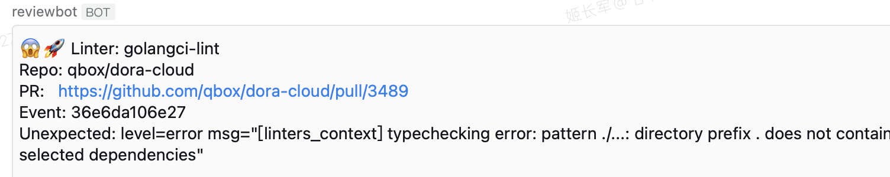

# reviewbot - build your self-hosted automated code analysis and review server easily

[](https://github.com/qiniu/reviewbot/actions/workflows/go.yml)
[](https://goreportcard.com/report/github.com/qiniu/reviewbot)
[](https://github.com/qiniu/reviewbot/releases)

Reviewbot 帮助你快速搭建一个自托管的代码分析和代码审查服务，支持多种语言和多种代码规范，尤其适合有大量私有仓库的组织。

所有的问题都会在 Pull Request 阶段，以 `Review Comments` 或`Github Annotations`形式来反馈，且精确到代码行。

- Github Check Run (Annotations)

  <div style="display: flex; justify-content: flex-start; gap: 10px;">
    
    
  </div>

- Github Pull Request Review Comments
  <div style="display: flex; justify-content: flex-start;">
    
  </div>

这种方式能帮助 PR 的作者避免在冗长的 console log 中查找问题，非常有利于问题改进。

## 目录

- [为什么选择 Reviewbot](#why-reviewbot)
- [安装](#installation)
- [已支持的 linters](#已支持的-linters)
  - [Go 语言](#go-语言)
  - [C/C++](#cc)
  - [Lua](#lua)
  - [Java](#java)
  - [Git 流程规范](#git-流程规范)
  - [文档规范](#文档规范)
- [配置](#配置)
  - [调整执行命令](#调整执行命令)
  - [关闭 Linter](#关闭-Linter)
  - [通过 Docker 执行 linter](#通过-Docker-执行-linter)
- [Reviewbot 运行流程](#reviewbot-运行流程)
- [观测检测结果](#观测检测结果)
- [贡献](#贡献)
- [许可证](#许可证)

## Why Reviewbot

Reviewbot 是一个自托管的代码分析和代码审查服务，支持多种语言和多种代码规范，尤其适合有大量私有仓库的组织:

- **安全性** - 推荐自托管，数据安全可控
- **面向改进** - 检测出的问题，都会优先以类 Review Comments 或 Github Annotations 形式优先反馈，方便问题改进
- **灵活性** - 支持多种语言和多种代码规范，也非常容易添加新的代码检查工具
- **可观测** - 支持 alert 通知，方便及时感知检测出的问题
- **可配置** - 支持通过配置来调整 linter 的执行命令、执行参数、执行环境等，非常灵活

Reviewbot 基于 golang 开发，逻辑简单，代码清晰，容易理解和维护。

## 安装

请参考 [getting started guide](https://reviewbot-x.netlify.app/getting-started/installation).

### 已支持的 linters

#### Go 语言

- [golangci-lint](/internal/linters/go/golangci_lint/)
- [gofmt](/internal/linters/go/gofmt/)
- [gomodcheck](/internal/linters/go/gomodcheck/)

#### C/C++

- [cppcheck](/internal/linters/c/cppcheck/)

#### Lua

- [luacheck](/internal/linters/lua/luacheck/)

#### Java

- [pmdcheck](/internal/linters/java/pmdcheck/)
- [stylecheck](/internal/linters/java/stylecheck/)

#### Git 流程规范

- [commit msg check](/internal/linters/git-flow/commit-check/)

#### 文档规范

- [note check](/internal/linters/doc/note-check/)

## 配置

`Reviewbot` 在配置方面尽可能追求 **无配置原则**，针对一般性的仓库检查都会固定到代码逻辑中。但也有一些特殊需求，可以通过配置完成.

注意: 所有的可配置项，都定义在 `config/config.go` 文件中，详细配置项可以参考这个文件。

以下是一些常见的配置场景:

### 调整执行命令

linters 一般都是用默认命令执行，但是我们也可以调整命令，比如

```yaml
qbox/kodo:
  linters:
    staticcheck:
      workDir: "src/qiniu.com/kodo"
```

这个配置意味着，针对`qbox/kodo`仓库代码的`staticcheck`检查，要在`src/qiniu.com/kodo`目录下执行。

我们甚至可以配置更复杂的命令，比如：

```yaml
qbox/kodo:
  linters:
    golangci-lint:
      command:
        - "/bin/sh"
        - "-c"
        - "--"
      args:
        - |
          source env.sh
          cp .golangci.yml src/qiniu.com/kodo/.golangci.yml
          cd src/qiniu.com/kodo
          export GO111MODULE=auto
          go mod tidy
          golangci-lint run --timeout=10m0s --allow-parallel-runners=true --print-issued-lines=false --out-format=line-number >> $ARTIFACT/lint.log 2>&1
```

这个配置意味着，针对`qbox/kodo`仓库代码的`golangci-lint`检查，通过自定义命令 command 和参数 args 来执行。

这里的 command 和 args 使用姿势，与 Kubernetes Pod 的 command 和 args 类似，可以参考[Kubernetes Pod](https://kubernetes.io/docs/concepts/workloads/pods/)

**$ARTIFACT** 环境变量值得注意，这个环境变量是 `Reviewbot` 内置的，用于指定输出目录，方便排除无效干扰。因为 `Reviewbot` 最终只会关心 linters 的输出，而在这个复杂场景下，shell 脚本会输出很多无关信息，所以我们可以通过这个环境变量来指定输出目录，让 `Reviewbot` 只解析这个目录下的文件，这样得到的检测结果会更加精准。

### 关闭 Linter

我们也可以通过配置，关闭某个仓库的某个 linter 检查，比如：

```yaml
qbox/net-gslb:
  linters:
    golangci-lint:
      enable: false
```

### 通过 Docker 执行 linter

默认情况下，`Reviewbot` 会使用本地安装的 linter 来执行检查，但有些场景下，我们可能希望使用 Docker 镜像来执行 linter，比如：

- 本地没有安装相关 linter
- 目标仓库需要不同版本的 linter 或依赖
- 目标仓库需要依赖很多第三方库，如果都安装到本地，会非常麻烦

在这些场景下，我们可以通过配置 Docker 镜像来完成 linter 的执行。比如:

```yaml
qbox/net-gslb:
  linters:
    golangci-lint:
      dockerAsRunner:
        image: "golangci/golangci-lint:v1.54.2"
```

这个配置意味着，针对`qbox/net-gslb`仓库代码的`golangci-lint`检查，使用`golangci/golangci-lint:v1.54.2`这个 Docker 镜像来执行。

## Reviewbot 运行流程

`Reviewbot` 目前主要作为 GitHub Webhook 服务运行，会接受 GitHub Events，然后执行各种检查，若检查出问题，会精确响应到对应代码上。

```
Github 事件 -> Reviewbot -> 执行 linter -> 反馈结果
```

### 基本流程如下:

- 事件进来，判断是否是 Pull Request
- 获取代码：
  - 获取 PR 影响的代码
  - clone 主仓
    - 主仓会作为缓存
  - checkout PR，并放置在临时目录
  - pull 子模块
    - 仓库若使用 submodule 管理则自动拉取代码
- 进入 Linter 执行逻辑
  - 筛选 linter
    - 默认只要支持的 linter 都对所有仓库适用，除非有单独配置
      - 单独配置需要通过配置文件显式指定
      - 显式指定的配置会覆盖默认的配置
  - 执行 linter
  - 通用逻辑
    - 执行相应命令，拿到输出结果
    - filter 输出的结果，只获取本次 PR 关心的部分
      - 有的 linter 关心代码
      - 有的 linter 关心其他
  - 做反馈
    - 有的 linter 给 Code Comment，精确到代码行
    - 有的 linter 给 issue comment

## 如何添加新的 Linter？

- 请从 [issues](https://github.com/qiniu/reviewbot/issues) 列表中选择你要处理的 Issue.
  - 当然，如果没有，你可以先提个 Issue，描述清楚你要添加的 Linter
- 编码
  - 基于 linter 关注的语言或领域，[选好代码位置](https://github.com/qiniu/reviewbot/tree/master/internal/linters)
  - 绝大部分的 linter 实现逻辑分三大块:
    - 执行 linter，一般是调用相关的可执行程序
    - 处理 linter 的输出，我们只会关注跟本次 PR 相关的输出
    - 反馈 跟本次 PR 相关的输出，精确到代码行
- 部署，如果你的 linter 是外部可执行程序，那么就需要在 [Dockerfile](https://github.com/qiniu/reviewbot/blob/master/Dockerfile) 中添加如何安装这个 linter
- 文档，为方便后续的使用和运维，我们应当 [在这里](https://github.com/qiniu/reviewbot/tree/master/docs/website/docs/components) 添加合适的文档

## 观察检测结果

Reviewbot 支持通过企业微信 alert 来通知检测结果，具体实现参考[这里](https://github.com/qiniu/reviewbot/blob/8bfb122a2e4292f1cc74aedab8f51d1a0c149d55/internal/metric/metrics.go#L17)

只需要在 Reviewbot 启动时，设置环境变量 `WEWORK_WEBHOOK` 就行，这个环境变量指向企业微信聊天组的机器人 URL，当检测出有效问题时，会自动发送通知。类似:

<div style="display: flex; justify-content: flex-start;">
  
</div>

如果遇到非预期的输出，也会发送通知，类似:

<div style="display: flex; justify-content: flex-start;">
  
</div>

对于非预期输出，**通常意味着相关 linter 默认的执行配置不支持当前仓库**，你需要通过配置文件基于实际情况显式指定。

## 贡献

Your contributions to Reviewbot are essential for its long-term maintenance and improvement. Thanks for supporting Reviewbot!

If you find a bug while working with the Reviewbot, please open an issue on GitHub and let us know what went wrong. We will try to fix it as quickly as we can.

## License

Reviewbot is released under the Apache 2.0 license. See the [LICENSE](/LICENSE) file for details.
