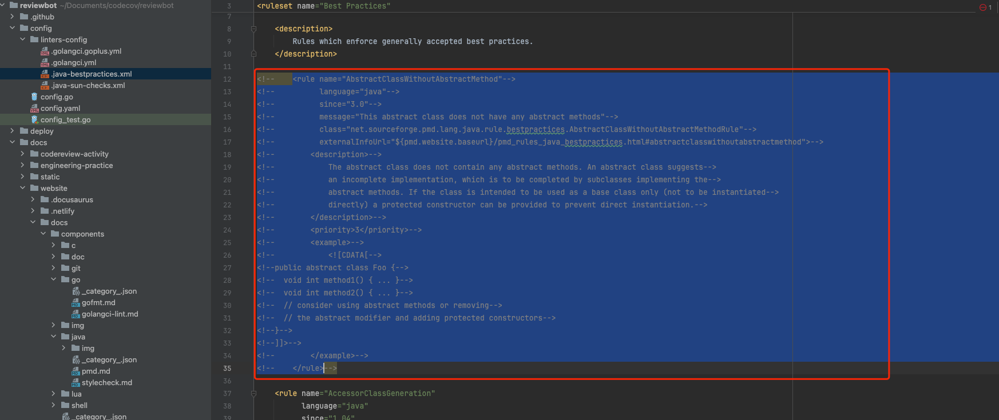

[PMD](https://docs.pmd-code.org/pmd-doc-7.1.0/index.html) 是一款采用 BSD 协议发布的 Java 程序代码检查工具。该工具可以做到检查 Java 代码中是否含有未使用的变量、是否含有空的抓取块、是否含有不必要的对象等。
**Reviewbot** 默认使用的是PMD提供的BestPractices规则库[BestPractices](https://github.com/pmd/pmd/tree/master/pmd-java/src/main/java/net/sourceforge/pmd/lang/java/rule/bestpractices)。

默认情况下, **Reviewbot** 使用以下命令来对Java代码进行检查:

```bash
pmd check -f emacs -R bestpractices.xml  xx1.java xx2.java
```

:::info
PMD官方提供了许多其他的代码检查规则。
详情参见: https://github.com/pmd/pmd/tree/master/pmd-java/src/main/java/net/sourceforge/pmd/lang/java/rule
:::
### 规则文件配置
PMD的检查规则配置支持两种方式,在`config.yaml`文件中，globalDefaultConfig>javapmdcheckruleConfig项配置对应的pmd规则文件路径或者网络路径。
- 1.文件路径：
   ```yaml
    globalDefaultConfig: # global default settings, will be overridden by qbox org and repo specific settings if they exist
        javapmdcheckruleConfig: "config/linters-config/.java-bestpractices.xml"
    ```
- 2.网络路径： 
  ```yaml
    globalDefaultConfig: # global default settings, will be overridden by qbox org and repo specific settings if they exist
        javapmdcheckruleConfig: "https://raw.githubusercontent.com/pmd/pmd/master/pmd-java/src/main/resources/category/java/bestpractices.xml"
    ```
- 如果设置为空("")，reviewbot会自动下载PMD提供的BestPractices规则库[BestPractices](https://github.com/pmd/pmd/tree/master/pmd-java/src/main/java/net/sourceforge/pmd/lang/java/rule/bestpractices)

### 自定义规则

在实际的项目实施过程中，并不是系统的提供的所有规则都适合项目需要，有时候会需要对系统提供的规则进行裁剪，将不太适合项目需要的规则进行注释。
- 如图，将AbstractClassWithoutAbstractMethod规制进行注释后，PMD 将不都会对代码针对该项规则的检查


- 如果想进一步编写更加符合项目特征的代码检查规则，还可以自动编写PMD规则加入到Reviewbot指定的规则文件中。编写方式可以参见 [PMD自定义规则官方文档](https://docs.pmd-code.org/latest/pmd_userdocs_extending_writing_rules_intro.html)
- [PMD自定义规则入门](https://docs.pmd-code.org/latest/pmd_userdocs_extending_your_first_rule.html)
