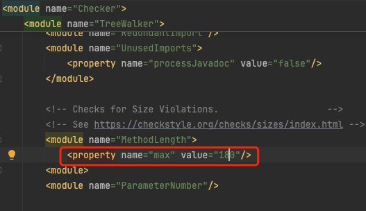

[CheckStyle](https://github.com/checkstyle/checkstyle) 是 SourceForge 下的一个项目，提供了一个帮助 JAVA 开发人员遵守某些编码规范的工具。它能够自动化代码规范检查过程，从而使得开发人员从这项重要，但是枯燥的任务中解脱出来。CheckStyle提供了大部分功能都是对于代码规范的检查。
**Reviewbot** 默认使用的是sun提供的规则库[sun_style](https://checkstyle.org/sun_style.html)。

默认情况下, **Reviewbot** 使用以下命令来对Java代码进行stylecheck检查:

```bash
java -jar checkstyle-10.17.0-all.jar run -c sun_checks.xml xx1.java xx2.java
```

:::info
Checkstyle提供了许多的代码风格检查规则。
详情参见: https://checkstyle.org/checks.html
:::
### 规则文件配置
stylecheck的检查规则配置支持两种方式。在`config.yaml`文件中，globalDefaultConfig>javastylecheckruleConfig项配置对应的stylecheck文件路径和网络路径
- 1.文件路径： 
   ```yaml
        globalDefaultConfig: # global default settings, will be overridden by qbox org and repo specific settings if they exist
            javastylecheckruleConfig: "config/linters-config/.java-sun-checks.xml"
    ```
- 2.网络路径：
   ```yaml
        globalDefaultConfig: # global default settings, will be overridden by qbox org and repo specific settings if they exist
              javastylecheckruleConfig: "https://raw.githubusercontent.com/checkstyle/checkstyle/master/src/main/resources/sun_checks.xml"
    ```

如果设置为空("")，reviewbot会自动下载sun提供的规则库[sun_style](https://checkstyle.org/sun_style.html)

### 规则设置
在实际的项目实施过程中，并系统提供的所有规则并不一定都适合项目需要，需要将不太适合项目需要的规则进行注释，或者根据项目需要对规则的属性进行修改。

规则及相关属性说明见[官方文档](https://checkstyle.org/checks.html)

- 举例：如图 可以根据项目需要修改property 设置代码方法长度的检查
